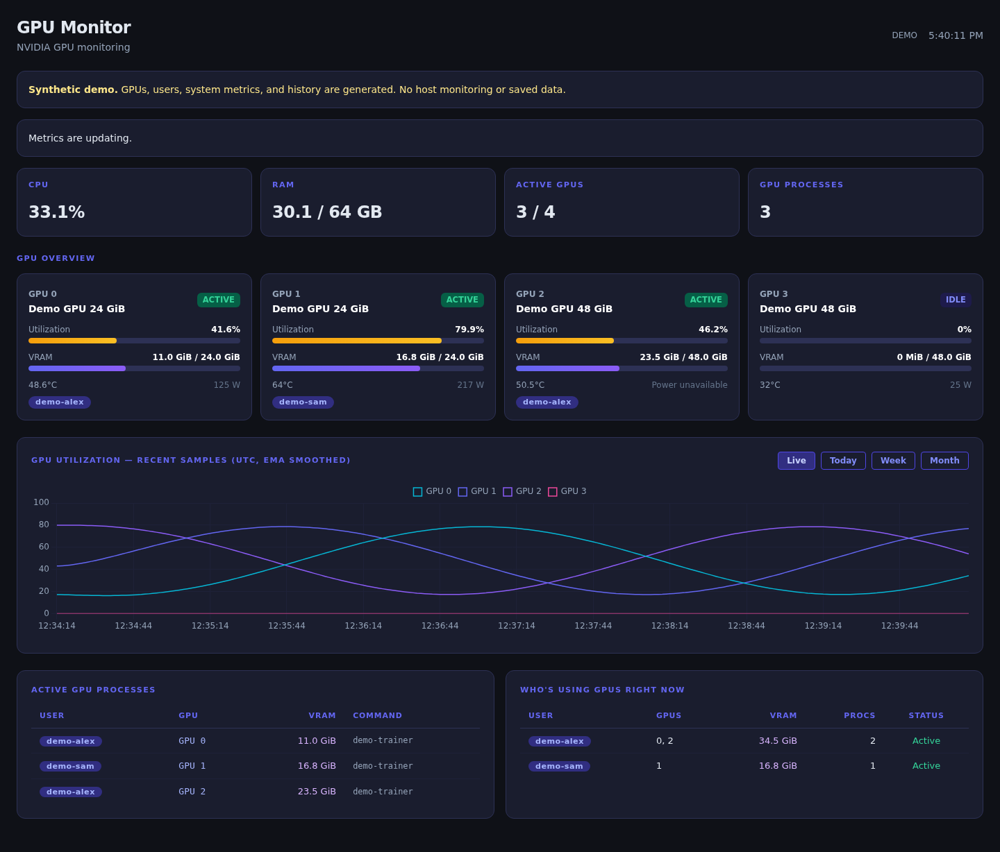
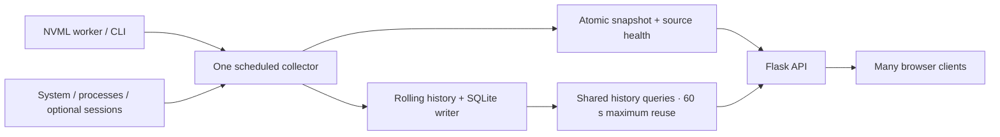

# GPU Roster

A lightweight dashboard for GPU utilization, memory, and process ownership on a shared NVIDIA host.

The application combines Flask, NVML (with a `nvidia-smi` fallback), psutil, and SQLite. One scheduled collector supplies every dashboard with the same snapshot. It shows live metrics, a rolling utilization chart, and up to 31 days of utilization history. Session estimates are optional. The supported launcher uses one Waitress process with four HTTP worker threads.



The screenshot comes from the built-in demo; it contains no real host or user data.

## Try without a GPU

Use Linux and Python 3.10 or newer:

```bash
git clone https://github.com/drakishev/gpuroster.git
cd gpuroster
python3 -m venv venv
venv/bin/python -m pip install --require-hashes --only-binary=:all: -r requirements/build.lock -r requirements/runtime.lock
venv/bin/python -m pip install --no-deps --no-build-isolation .
venv/bin/gpuroster --demo
```

Open **http://127.0.0.1:18081**. Demo mode shows four generated GPUs, example processes/users, synthetic system metrics, and populated live/today/week/month charts. It reads no GPU tools, host processes, or login records, and never opens or writes `GPUROSTER_DB_PATH`. History is generated in memory and disappears on exit. A persistent banner and API mode markers identify the data as synthetic.

`GPUROSTER_DEMO=1` also enables demo mode. Optional session panels use generated examples when `GPUROSTER_SHOW_SESSIONS=1`. Normal authentication, loopback restrictions, and privacy defaults still apply. After dependency installation, the dashboard works without internet access. See the [demo and asset decision](docs/architecture/ADR-005-offline-assets-and-demo.md).

## Monitor a real host

Use Python 3.10 or newer on Linux, an NVIDIA driver providing NVML (`libnvidia-ml`), and permission to inspect the relevant processes. `nvidia-smi` is needed for the CLI fallback. Optional session history needs util-linux `last` with ISO timestamp support and readable login records.

```bash
git clone https://github.com/drakishev/gpuroster.git
cd gpuroster
python3 -m venv venv
venv/bin/python -m pip install --require-hashes --only-binary=:all: -r requirements/build.lock -r requirements/runtime.lock
venv/bin/python -m pip install --no-deps --no-build-isolation .
bash start.sh
```

Open **http://127.0.0.1:18081**. The launcher binds to loopback by default. Missing GPU tools produce visible partial-data status; they do not prevent the web interface from opening.

For a remote machine, keep the application on loopback and use an SSH tunnel:

```bash
ssh -N -L 18081:127.0.0.1:18081 user@example.invalid
```

Replace the example SSH destination with your own. Open the same local URL after the tunnel connects. Other users on the server can reach its loopback interface; configure authentication on a shared host.

## Installed command

After installation, activate the environment and run `gpuroster` from any directory. `gpuroster --version` reports the installed version. Templates, CSS, Chart.js, and dashboard JavaScript are included in the wheel; the dashboard needs no external network access. GPU Roster is supported on Linux with Python 3.10 or newer.

The commands above use [tested dependency locks](requirements/README.md). Normal pip resolution remains supported by the package metadata. CI also produces [verified build bundles](docs/releases.md) with a wheel, source archive, locks, checksums, and build information after all checks pass.

See the [deployment guide](docs/deployment.md) for systemd, password files, persistent state, SSH/TLS access, and migration/rollback. The [production-serving decision](docs/architecture/ADR-004-production-deployment.md) records alternatives and measured results.

## Access and privacy

Optional HTTP Basic authentication protects the page, static assets, and every API. Set credentials through your service's secret configuration or read them interactively without placing values in shell history:

```bash
read -r -p 'Dashboard username: ' GPUROSTER_AUTH_USER
read -r -s -p 'Dashboard password: ' GPUROSTER_AUTH_PASSWORD
printf '\n'
export GPUROSTER_AUTH_USER GPUROSTER_AUTH_PASSWORD
bash start.sh
```

Basic authentication requires an encrypted transport: use an SSH tunnel or a TLS-terminating reverse proxy. The application does not provide TLS or user account management. Non-loopback binding requires both credentials, and forwarded identity headers are not trusted. See the [access decision](docs/architecture/ADR-001-access-and-collection-safety.md).

Process owners, PIDs, and executable names remain available to authorized viewers. Command arguments and login/session details are disabled by default. Enabling them may disclose sensitive command arguments or client addresses to every viewer.

| Environment variable | Default | Purpose |
| --- | --- | --- |
| `GPUROSTER_DEMO` | `0` | Use synthetic sources and in-memory history; `--demo` also enables this mode |
| `GPUROSTER_HOST` | `127.0.0.1` | Listening address |
| `GPUROSTER_PORT` | `18081` | Listening port |
| `GPUROSTER_AUTH_USER` | unset | Basic-auth username; requires password |
| `GPUROSTER_AUTH_PASSWORD` | unset | Basic-auth password; requires username |
| `GPUROSTER_AUTH_PASSWORD_FILE` | unset | Read a password from a protected file; cannot be combined with `GPUROSTER_AUTH_PASSWORD` |
| `GPUROSTER_SHOW_COMMANDS` | `0` | Include truncated command arguments |
| `GPUROSTER_SHOW_SESSIONS` | `0` | Enable SSH connections and login/session APIs and panels |
| `GPUROSTER_COMMAND_TIMEOUT` | `3` | Timeout in seconds for each command or NVML worker response; greater than 0, at most 30 |
| `GPUROSTER_GPU_BACKEND` | `auto` | Prefer the NVML worker; fall back to CLI if initialization is unavailable. Explicit choices: `nvml`, `smi` |
| `GPUROSTER_COLLECT_INTERVAL` | `3` | Shared collection interval in seconds, 0.1–60; clients do not change it |
| `GPUROSTER_SESSION_INTERVAL` | `60` | Optional session/SSH evidence refresh in seconds, 1–3600 |
| `GPUROSTER_TIMEZONE` | `UTC` | IANA timezone defining “today”; API timestamps and chart labels remain UTC |
| `GPUROSTER_DB_PATH` | See below | SQLite history file; launcher creates the parent directory |

`bash start.sh` and `python app.py` retain the checkout’s `gpu_stats.db`. The installed `gpuroster` command and `python -m gpuroster` default to `$XDG_STATE_HOME/gpuroster/history.db` (or `~/.local/state/gpuroster/history.db`). Set `GPUROSTER_DB_PATH` explicitly when migrating an existing installation; the launcher never copies an old database automatically.

Boolean options accept `0`, `1`, `false`, or `true`. Environment variables are read at startup; `.env` files are not loaded automatically. Keep databases and credentials outside Git.

When neither password option is set, the launcher also reads `dashboard-password` from systemd's `CREDENTIALS_DIRECTORY` if provided. A missing or empty configured credential fails startup.

## Development and checks

Ordinary tests need no GPU, login records, credentials, or production database. Browser tests use synthetic metrics and also exercise the real packaged assets with external requests blocked.

```bash
venv/bin/python -m pip install --require-hashes --only-binary=:all: -r requirements/build.lock -r requirements/dev.lock
venv/bin/python -m playwright install --with-deps chromium
venv/bin/python -m unittest discover -s tests -v
venv/bin/python -m unittest discover -s tests/browser -v
venv/bin/python -m unittest discover -s tests/packaging -v
venv/bin/python scripts/lock_dependencies.py --check
venv/bin/ruff check .
venv/bin/ruff format --check .
node --check gpuroster/static/dashboard.js
bash -n start.sh
```

Backend tests alone need only the runtime dependencies:

```bash
venv/bin/python -m unittest discover -s tests -v
```

[CI](.github/workflows/ci.yml) checks locked installs on Python 3.10/3.12/3.14 and separately tests current compatible runtime dependencies. It runs Chromium regressions, checks formatting/lint and asset/lock drift, tests installed packages, audits runtime dependencies, and compares two independent release builds before uploading the tested bundle. See [benchmarks](docs/benchmarks.md), [Phase 6 validation](docs/validation/phase-six.md), and [contribution guidelines](CONTRIBUTING.md).

## Architecture



The collector runs in one thread in the web process. NVML calls run in one persistent child process so a stalled driver call can time out and the worker can be restarted. CLI collection remains available. API requests copy published snapshots; they never poll hardware. Historical requests share SQLite results per range for less than 60 seconds from query start; a successful write invalidates prior results. Responses expose query time/age separately from current writer health. See [ADR-006](docs/architecture/ADR-006-shared-history-queries.md).

Collection attempts use a monotonic schedule and skip missed intervals rather than accumulating work. Snapshots carry a sequence number, UTC collection timestamp, backend name, and source ages. An HTTP response does not make an old measurement fresh. The first CPU interval is unknown until the collector has a baseline.

Code lives in the `gpuroster` package: `server.py` owns HTTP and collector startup/shutdown; `app.py` serves HTTP and enforces access; `monitoring/models.py` defines measurements; `collectors.py` and `nvml.py` read sources; `service.py` owns scheduling/cache/lifecycle; `sessions.py` accounts for intervals; `history.py` owns rolling data and SQLite. See [ADR-002](docs/architecture/ADR-002-shared-collection.md) and [ADR-003](docs/architecture/ADR-003-time-identity-and-accounting.md).

## Changes from the baseline

- The default bind changed from all interfaces to loopback. Remote binding without configured authentication is rejected.
- Session endpoints return `403` unless explicitly enabled. The default process `command` contains an executable name instead of arguments.
- Unsupported GPU metrics are `null`, with collection failures described in `health.sources`. The dashboard distinguishes partial, stale, and unavailable values.
- Non-interactive SSH is labeled as such; it no longer implies VS Code. API fields changed from `has_vscode` to `has_noninteractive_ssh`, and the synthetic session source is now `noninteractive_ssh`.
- Imports no longer initialize SQLite or start threads. Use `gpuroster`, `python -m gpuroster`, or the compatibility checkout launcher `bash start.sh`. A bare WSGI factory (`gpuroster.app:create_app`) does not start collection or acquire database ownership.
- Phase 1 preserved the database schema. Phase 2 adds a nullable `gpu_uuid` column on the collector's first write. Existing records remain labeled as legacy index history; they are not assigned to a current GPU. The application database has not been migrated merely by checking out or importing this code.

## Phase 2 API and database migration

Install the updated requirements before restarting. Stop the old instance and back up its SQLite file before launching the new collector. Use one web process; do not run multiple instances against the same database. The migration adds a column and preserves rows within the existing 31-day retention policy. Ordinary writes still remove expired rows. Old explicit-column inserts remain compatible, but rolling back cannot restore UUID-based history semantics.

`/api/stats` now returns `schema_version: 2`, `sequence`, and the actual collection timestamp. GPU records include `uuid`; processes include `gpu_uuid`, and an unmapped index is `null`. Live `history` is keyed by UUID with numeric Unix-second timestamps; `history_devices` supplies display indices. Historical datasets have stable `id` values, UTC ISO labels, and explicit gaps. GPU/process memory fields retain their old API names but mean MiB/GiB; system RAM also exposes exact byte counts. See the [snapshot contract](docs/architecture/snapshot-v2.md).

Before the first snapshot, `/api/stats` returns `503 collector_not_ready`. Starting the collector is explicit: importing a WSGI app alone will not start it. Session endpoints use cached evidence and return 503 when required sources are unavailable or stale. Truncated or malformed records are marked partial in source health.

Connected time is the union of a user's session intervals, clipped to each window. Simultaneous terminals count once. “Today” uses the configured timezone (including DST); week/month mean the preceding 7/30 elapsed days. Non-interactive SSH contributes only currently visible evidence and is not persisted as an authoritative session ledger.

## Current limits and next work

An optional [read-only hardware validation command](docs/validation/hardware.md)
checks NVML/CLI agreement, native worker memory, and worker recovery on a target
host. Ordinary CI remains hardware-independent. The collector reports physical
GPUs; per-MIG-instance monitoring is not implemented.
The [Phase 7 results](docs/validation/phase-seven.md) record a passing 15-minute
eight-GPU observation and bounded synthetic identity retention, with explicit
driver and permission coverage limits.

The launcher uses Waitress with four HTTP threads, one collector thread, and a child NVML worker. A local advisory lock rejects a second launcher using the same database. SIGINT and SIGTERM stop the HTTP loop and collector; in-flight responses may be interrupted during shutdown. Use one instance on a local filesystem. The cache is process-local: there is no supported multi-worker web deployment yet.

Benchmarks cover one host and synthetic clients; they are not broad NVIDIA-driver or MIG compatibility certification. Slow OS process inspection can still delay a collection cycle, while clients continue to receive cached data with age/status. Cold history queries still occupy HTTP threads; shared results avoid duplicate aggregation. Larger retention, downsampling, and an independent collector service remain future architecture work.

Connected-time estimates now handle overlap and window boundaries, but login logs may be rotated, truncated, incomplete, or inaccessible. SSH process visibility depends on OS permissions. These estimates are not billing records or GPU usage time.

Frontend assets are served locally under a restrictive content policy; Node is needed only to rebuild them. See the [asset workflow](frontend/README.md). Python locks cover deployment/build dependencies; operating-system, browser-system, and NVIDIA driver dependencies remain external. Demo data is illustrative; it cannot validate driver support or target-host permissions.
