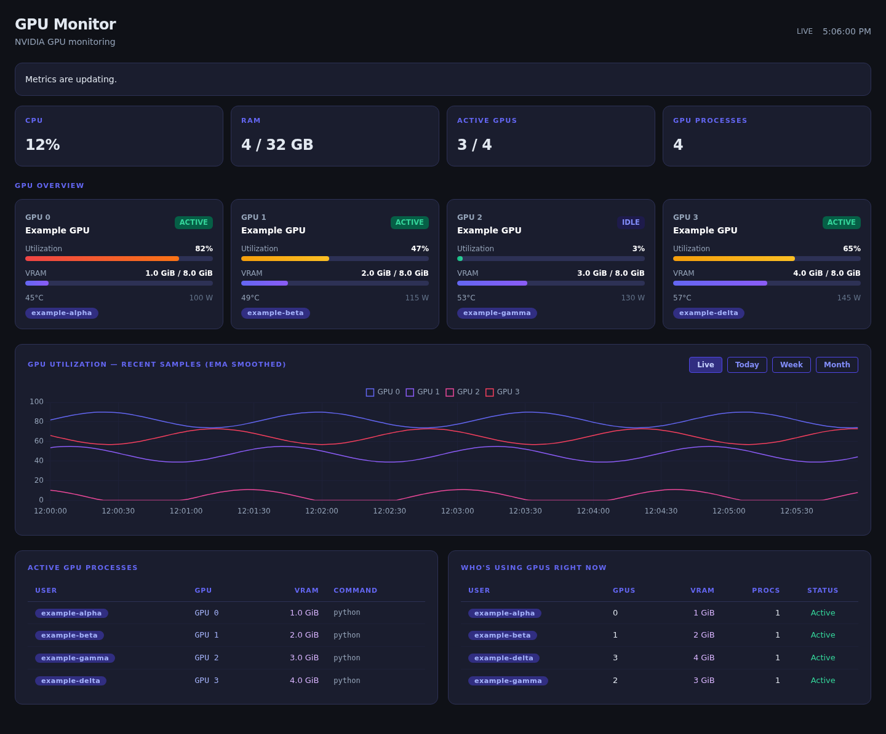
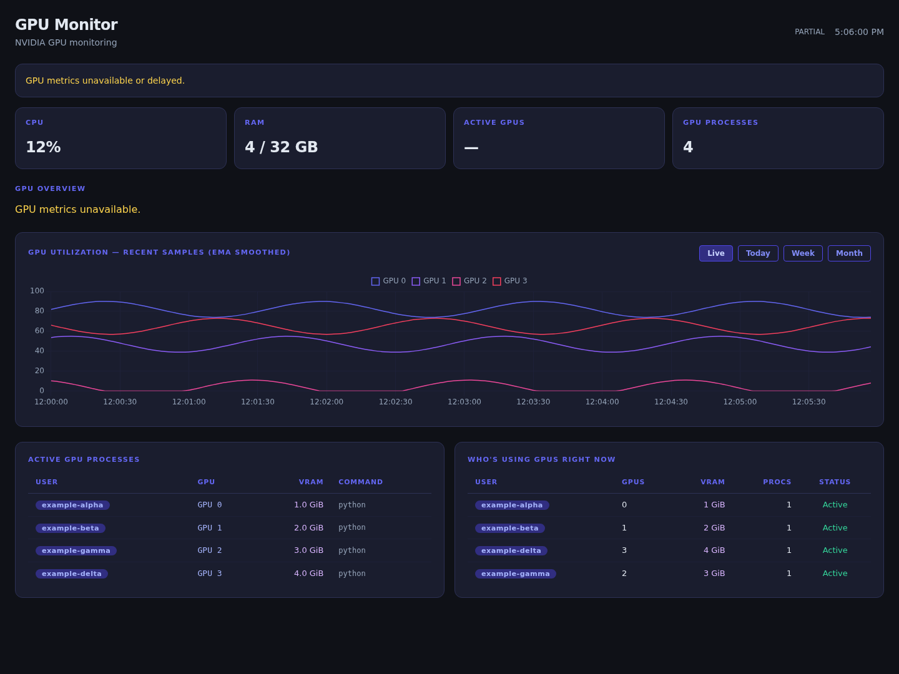

# Phase 1 validation

Recorded: 2026-10-01. Fixtures are synthetic, and each backend test uses an isolated temporary database. No tests require a GPU or read the existing history database.

## Automated checks

The initial Phase 1 implementation passes 27 backend and 10 Chromium tests. Backend checks were run locally on Python 3.10 and 3.12. All six jobs in the [first GitHub Actions run](https://github.com/drakishev/gpuroster/actions/runs/36844351691) passed, including backend tests on Python 3.10, 3.12, and 3.14 and Chromium browser tests.

| Area | Evidence |
| --- | --- |
| Access | Home, static assets, and APIs reject missing credentials; remote and rebinding requests are rejected before collection; spoofed forwarded headers do not bypass the check |
| Privacy | Disabled session routes do not collect; default process rendering never reads arguments; collector children do not inherit dashboard credentials |
| Collection | A real sleeping subprocess is interrupted by a configured 50 ms timeout; missing commands and failures expose safe codes; malformed/nonfinite output is rejected |
| Missing measurements | Unsupported GPU fields retain the GPU with null values; unavailable process memory is not summed as zero |
| Persistence | Failed commits can retry immediately; history reads do not create a missing database; unavailable utilization creates a live gap; imports create neither threads nor database connections |
| Lifecycle | Starting twice creates one sampler thread in the same process; sampler failures and stale samples are observable |
| SSH metadata | Spoofed titles, mismatched owners, and writable or user-owned executables cannot create accepted SSH connection entries |
| Browser safety | HTML/event-handler payloads in GPU names, usernames, commands, hosts, and terminals remain text; filtering still works |
| Browser failures | HTTP failures, recovery, missing chart scripts, stale values, request timeouts, and non-overlapping stats polling are exercised |
| Chart state | Live labels retain midnight order; changing GPU identity updates datasets; late history responses cannot overwrite a newer range selection |

Python lint/format, JavaScript syntax, shell syntax, and diff whitespace checks pass. A runtime dependency audit found no known vulnerabilities in the resolved packages at validation time; CI repeats the audit against current advisory data.

Browser regression tests stub Chart.js and Tailwind for deterministic offline execution. A separate local visual smoke check used actual Chart.js 4.4.3 and Tailwind 3.4.17 with synthetic API responses, verified four chart datasets, and produced the screenshots below. This is a rendering check, not a performance benchmark or a real-GPU compatibility claim.

## Visual checks

Default privacy settings, four synthetic devices:

GPU collection timeout while other sources remain available:

## Remaining validation

Run optional hardware checks across supported NVIDIA drivers and permission configurations before a release. Measure collector latency, CPU/memory overhead, 1/5/20/50 concurrent clients, and realistic storage/query sizes before selecting the next collection and storage architecture. The current per-client polling implementation does not satisfy the future shared-collector scaling target.
