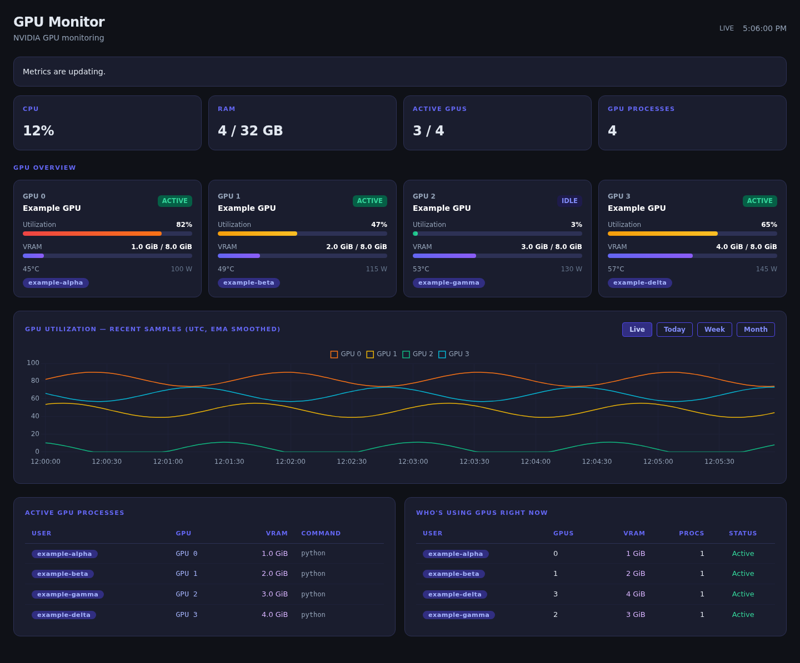

# Phase 2 validation

Recorded 2026-10-01. Backend and browser regression fixtures are synthetic; all persistence tests use temporary databases. The Phase 1 protections remain covered after responsibilities moved into `monitoring/`.

## Automated checks

The suite contains 59 backend/collector/history/session tests and 12 Chromium tests. CI runs the backend suite on Python 3.10, 3.12, and 3.14 and browser tests separately. It also checks Python lint/format, JavaScript/shell syntax, clean dependency installation, and runtime dependency advisories.

New regression coverage includes:

- 1/5/20/50 simultaneous cache readers, immutable publication, mutation isolation, and request reuse of the same source sample.
- Cache reads while a source blocks, monotonic staleness, independent source errors/recovery, and storage failure without discarding hardware metrics.
- NVML worker timeout/termination/restart, unexpected exit, initialization-only fallback, unsupported metrics, missing process memory, and privacy-preserving process attribution.
- CPU warm-up and restart baselines; sessions collected at their own cadence and never from requests.
- UTC/UUID live charts, midnight ordering, stable series color across index changes, and collector staleness even when HTTP responses succeed.
- Additive database migration, legacy read-only compatibility, old explicit-column inserts, retry after write failure, index swaps, missing buckets, retention, and wall-clock changes during monotonic write scheduling.
- Session interval union, duplicate/disjoint intervals, clipping across day/week/month boundaries, DST day lengths, ISO offsets, full usernames, optional hosts, malformed/crashed records, truncation, and spoofed SSH metadata.

Commands:

```bash
python -m unittest discover -s tests -v
python -m unittest discover -s tests/browser -v
ruff check .
ruff format --check .
node --check static/dashboard.js
bash -n start.sh
```

## Experiments and smoke checks

[Benchmarks](../benchmarks.md) record the NVIDIA backend comparison, isolated NVML worker, real loopback HTTP delivery for 1/5/20/50 synthetic clients, and 1/7/30/90-day synthetic storage cases. Hardware timing emits only aggregate statistics.

A separate real launcher smoke check used temporary authentication and a temporary database. It verified NVML selection, a healthy eight-GPU snapshot, hidden sessions, UUID fields, and persisted historical datasets. No real API payloads or credentials were published. A checksum check confirmed that the existing application database remained unchanged.

The current UI preview below uses synthetic identities and measurements with real Chart.js and Tailwind rendering. It is documentation imagery, not an implemented demo mode.



## Limits

These checks do not establish production serving readiness or support for every NVIDIA driver/GPU/MIG configuration. Process inspection can still be delayed by the OS. Login records and live SSH evidence can be incomplete, and historical user session state is not persisted. Multi-worker web deployment needs collector ownership outside the current process-local cache.
